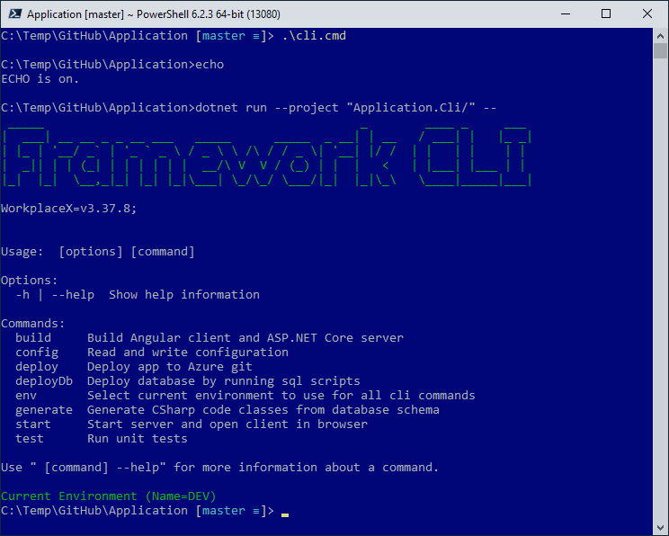

# Application
A template to get started with ASP.NET Core 3.1 application with Angular 10 client and MS-SQL Server database.

 (ApplicationDemo; github actions;)

## Getting Started
Clone repo and start command line interface.
```cmd
git clone https://github.com/WorkplaceX/Application.git --recursive
cd Application
.\cli.cmd
```
Command line interface CLI contains all necessary framework commands:



For ConnectionString, deploy sql scripts to database and start the application see: https://workplacex.org/install#git-clone

## Project Folder and File Structure
* "Application/" (Application with custom business logic in C#)
* "Application.Cli/" (Command line interface to build and deploy in C#)
* "Application.Cli/DeployDb/" (SQL scripts to deploy to SQL server)
* "Application.Database/" (From database generated C# database dto objects like tables and views)
* "Application.Doc/" (Documentation images)
* "Application.Server/" (ASP.NET Core to start application)
* "Application.Website/" (Custom html and css websites used as masters)
* "Framework/" (External WorkplaceX framework)
* "ConfigCli.json" (Configuration file used by Application.Cli command line interface)
* "ConfigServer.json" (Generated configuration used by Application.Server web server)
